# Easy School Website
The official website of Easy School, a fun school with flexible courses. this application was created as part of learning to work with spring boot

### Configuration

To run the application for the first time, few configurations are needed :

- On your local sql server, create a database named **easyschool**
- if you're using SQL on the *3306* port make sure to change it in the applications properties
- run the two scripts inside the static folder, *schema.sql* first to create the tables of the database and establish the relationships between them, then *data.sql* to populate some tables with some dummy data and necessary data
- run the application by running the main *SchoolbootApplication*
- Open the application on `localhost:8080`
- You can create a new student account or login using the administrator credentials : Email : *admin@eazyschool.com* && Password : *admin*

### Features 

- Info about the school, the courses, and the professors in the home page
- Courses page and courses categories
- A holidays list page
- About page with more information
- Contact forum with no authentication to contact the school
- Authentication as the admin or a student
- **Student features :**
  - Edit personal information (name, password, address...)
  - Consult assigned classes
- **Admin features :**
  - Edit personal information (name, password, address...)
  - Check the messages the school receives
  - Check the available classes, and the students assigned to that class
  - Assign existing students to a class
  - Check the list of courses, as well as the students enrolled in them
  - Assign a student to a course
  - Create a new class or course

### Bonus REST feature

although the application uses a Spring JPA in the application to store, display and manipulate data,
it can as well be deployed as a REST Api, you can check the available api after
logging in as the admin and consulting the following link *HAL explorer* : http://localhost:8080/data-api/
it should be something like this :

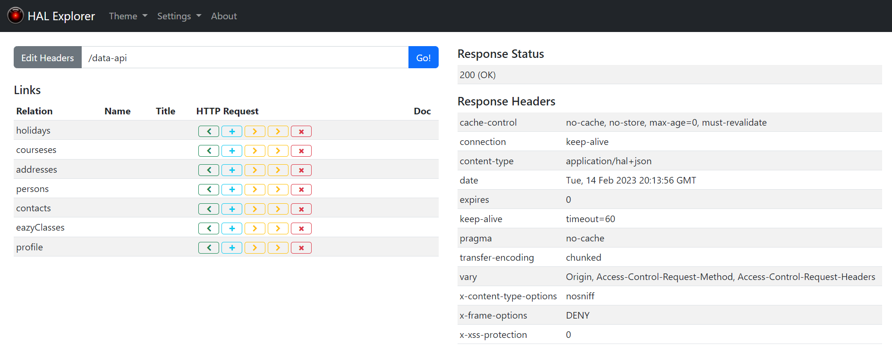

Here, you will find all the available links to use this application as a REST API another application makes use of.
per example `http://localhost:8080/data-api/contacts` will return messages stored in the *Contact* table in the database in JSON format :

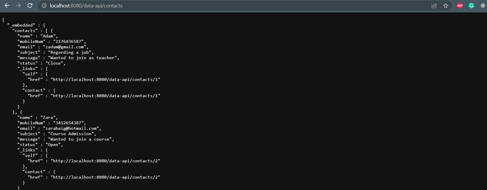

### Screenshots of the application :

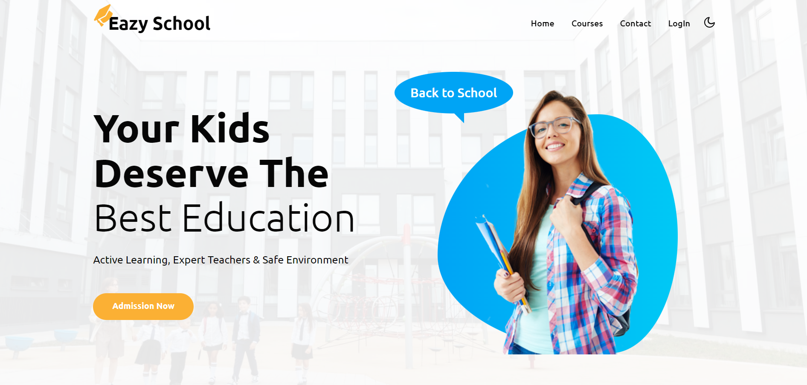

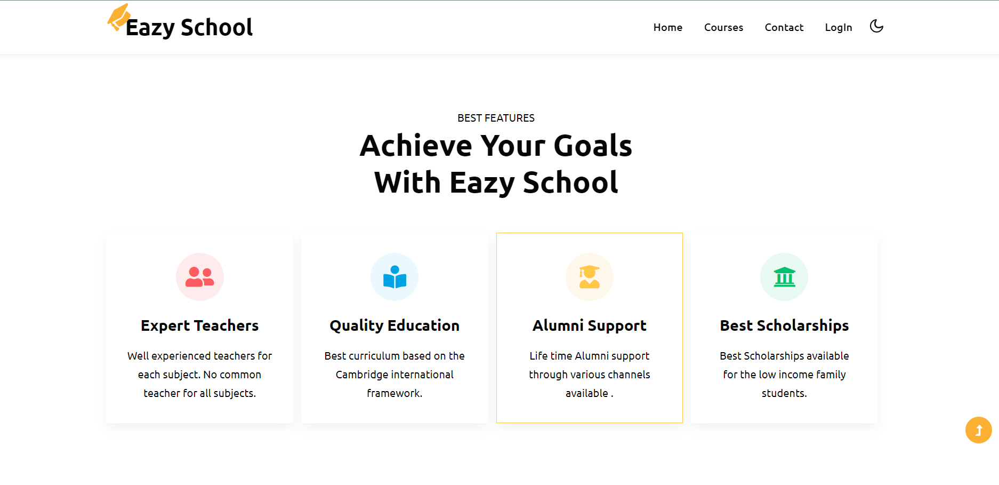

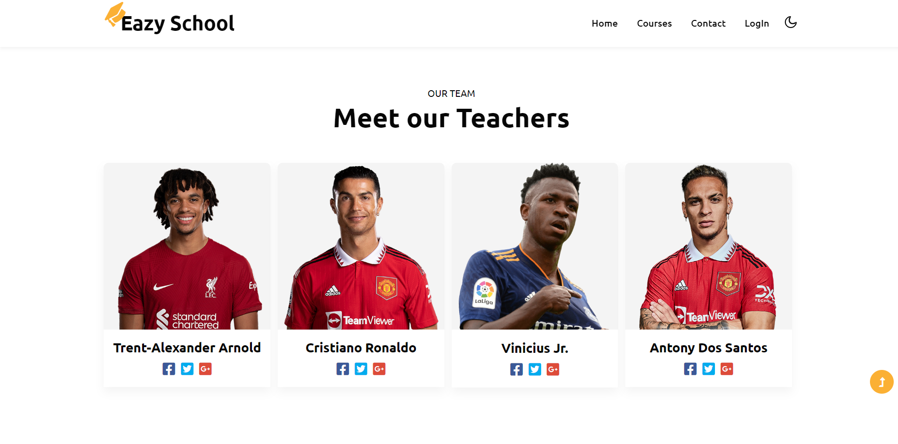

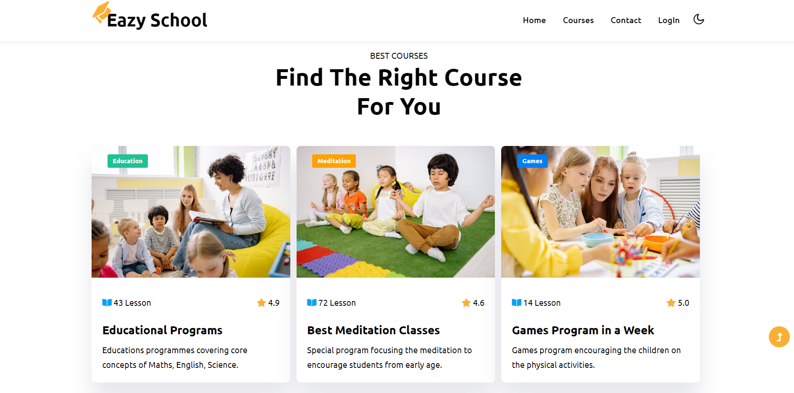

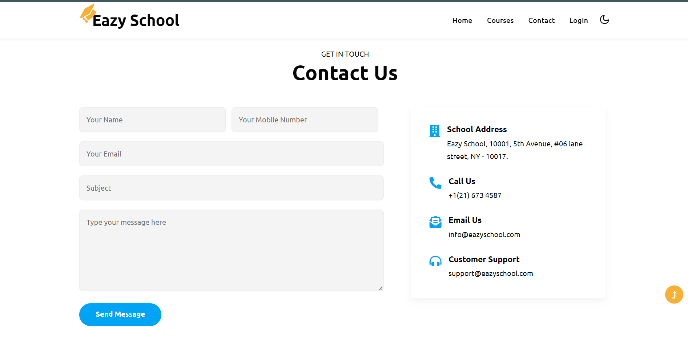

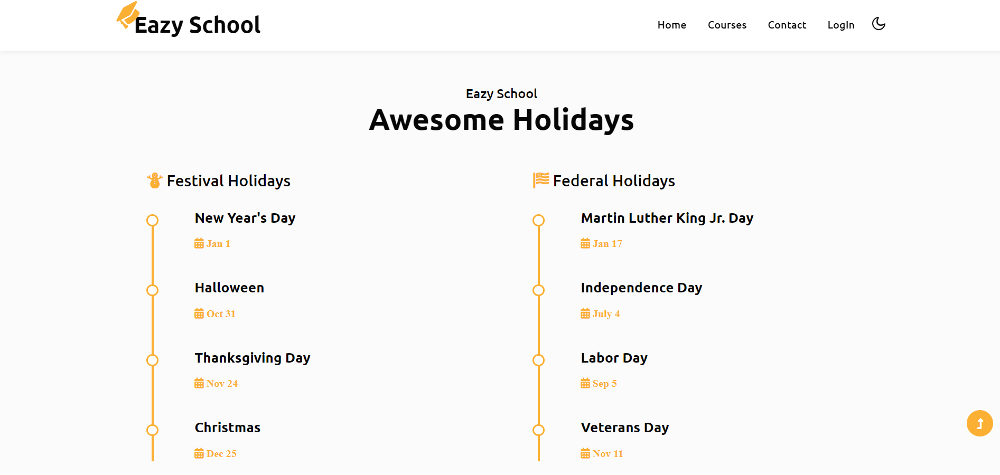

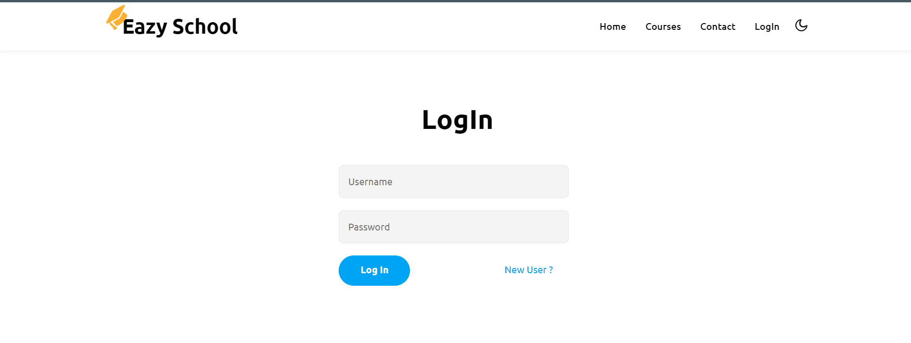

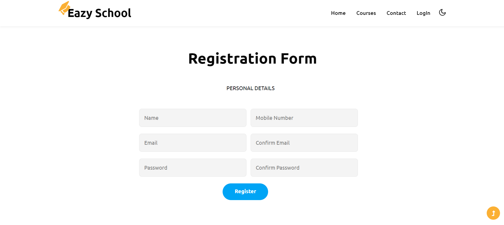

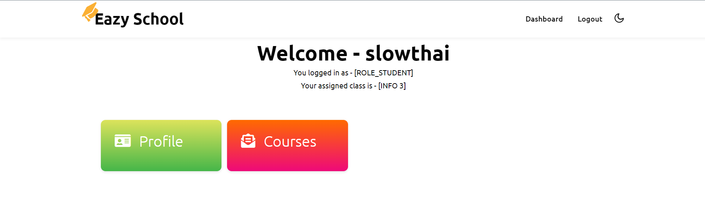

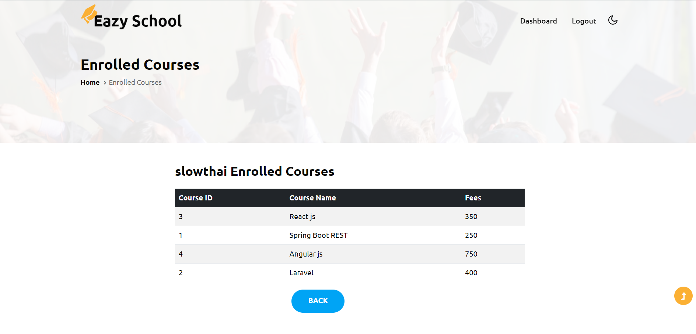

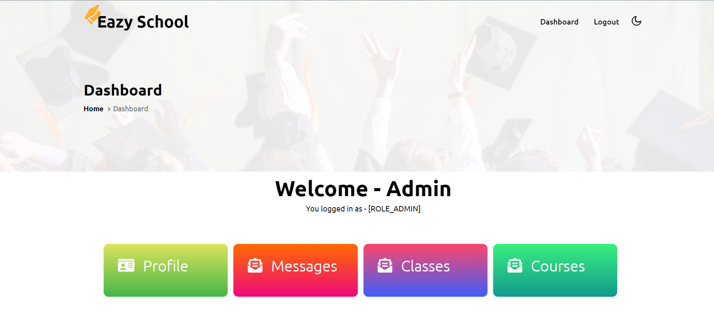

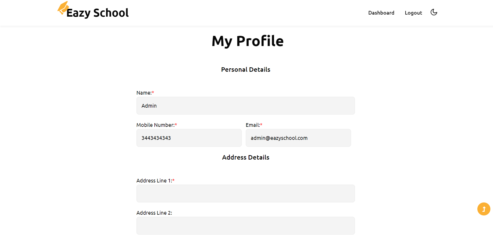

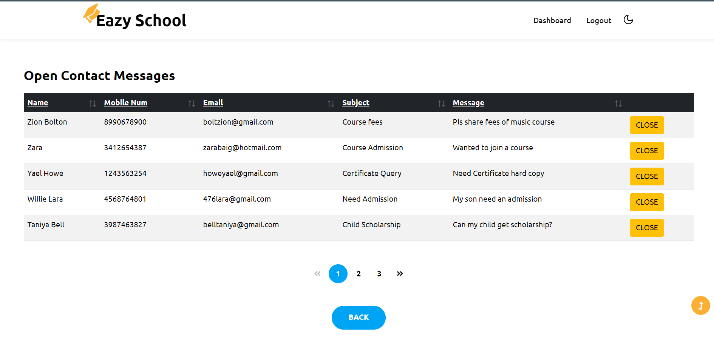

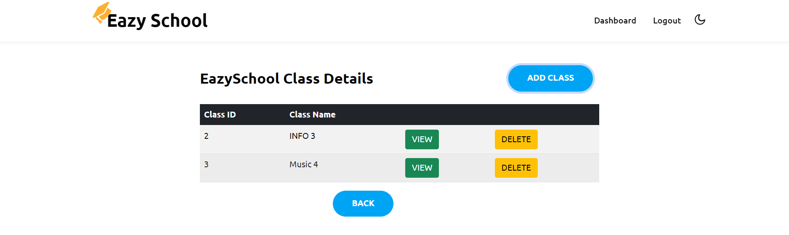

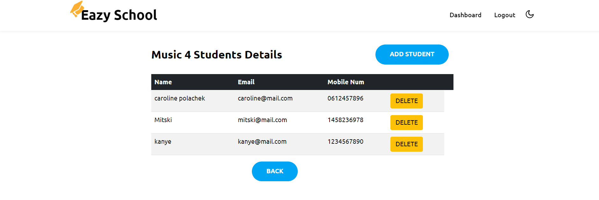

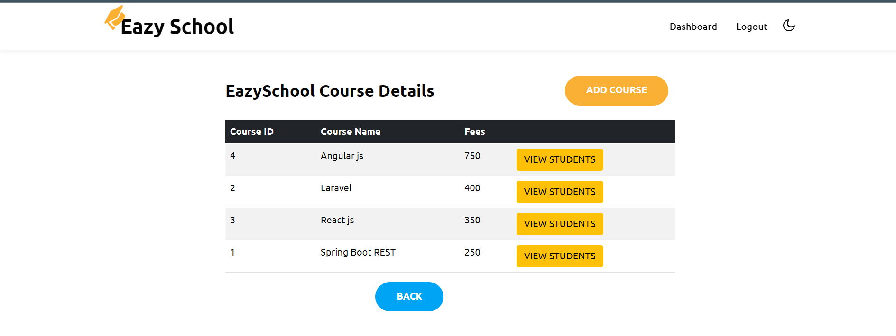